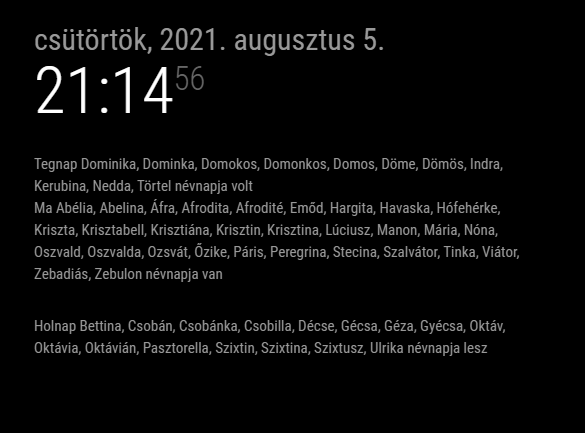

# MMM-Nevnap

Module for showing Hungarian name days.



## Installation

Navigate into MagicMirror's Module folder using termial:

```
cd ~/MagicMirror/modules
```

Clone this repository using following command:

```
git clone https://github.com/reddo/MMM-nevnap
```

Add the following text to `MagicMirror/config/config.js` to activate the module.

```
{
    module: "MMM-Nevnap",
    position: "top_left", // You can change this to your desired position.
    config: {
        //Here you can insert options listed below.
    }
},
```

## Configuration Options

| Option             | Description                                                                                                                                                                                                                                                                                                    |
| ------------------ | ---------------------------------------------------------------------------------------------------------------------------------------------------------------------------------------------------------------------------------------------------------------------------------------------------------------|
| `mode`             | Filter available modes.<br/> **Type:**`string`<br/> **Default:**`today`<br/>**Possible values:** Get a name day for today `today`, nameday for tomorrow `tomorrow`, nameday for yesterday `yesterday`. Search nameday by name `name`. Get a nameday for a specific day `day`.<br/> This option is **REQUIRED** |
| `day`              | Day in a month.<br/> **Type:**`integer`<br/> **Default:**`""`<br/>**Possible values:** `01`-`31`.<br/> This option is **REQUIRED** only when `day` mode is selected.                                                                                                                                           |
| `month`            | Month in a year.<br/> **Type:**`integer`<br/> **Default:**`""`<br/>**Possible values:** `01`-`12`.<br/> This option is **REQUIRED** only when `day` mode is selected.                                                                                                                                          |
| `name`             | Search for a name.<br/> **Type:**`string`<br/> **Default:**`""`<br/>This option is **REQUIRED** only when `name` mode is selected.                                                                                                                                                                             |
| `fontSize`      | Set a specific font-size for text.<br/> **Type:**`string`<br/> **Default:**`"1em"`<br/>**Possible values:** Any font-size value.<br/> This option is **NOT REQUIRED**                                                                                   |
| `updateInterval`   | Interval after which new content is fetched. This value is in milliseconds.<br/> **Type:**`integer`<br/> **Default:**`5*60*1000`(5 minutes)<br/>**Possible values:** `1000`-`86400000`.<br/> This option is **NOT REQUIRED**                                                                                   |
| `initialLoadDelay` | Delay before loading the module. The value is in milliseconds.<br/> **Type:**`integer`<br/> **Default:**`3000`(3 seconds)<br/>**Possible values:** `1000`-`5000`.<br/> This option is **NOT REQUIRED**.                                                                                                        |
| `retryDelay`       | The delay before retrying after failed request.<br/> **Type:**`integer`<br/> **Default:**`5000`(5 seconds)<br/>**Possible values:** `1000`-`60000`.<br/> This option is **NOT REQUIRED**.                                                                                                                      |
| `lang`             | This option lets you set a specific language to be used in this module.<br/> **Type:**`string`<br/> **Default:**`config.language`(default language set in config.js)<br/> This option is **NOT REQUIRED**.                                                                                                     |

## Dependencies

None.

## Special Thanks

Special thanks to [richardfous](https://github.com/richardfous/MMM-NameDay), on whose module I based mine.

## Issues

If you find any issues with this module, feel free to open a GitHub issue in this repository.
